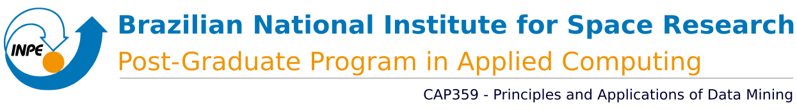

## Overview
This repository contains the project developed in the Principles and Applications of Data Mining Course (CAP359). Course taught by professor [Dr. Rafael Santos](http://www.lac.inpe.br/~rafael.santos), it's part of the Graduate Program in Applied Computing offered by the Brazilian National Institute for Space Research.

## Table of Contents
- **Environment setting**
  - [Dependencies and installations](https://github.com/AdrianoPereira/project-cap394/tree/master/docs/dependencies-and-installations.md)
- **Codes**
  - [Preprocessing](https://github.com/AdrianoPereira/CAP-359/tree/master/codes/preprocessing)
  - [Model](https://github.com/AdrianoPereira/CAP-359/tree/master/codes/model)
-  **Notebooks**
   -  [Report 📕](https://github.com/AdrianoPereira/CAP-359/blob/master/report.ipynb)

## Contact

:octocat: Github - [@AdrianoPereira](https://github.com/AdrianoPereira)
:email: Email - [adriano.almeida@inpe.br](mailto:adriano.almeida@inpe.br)
:earth_americas: Homepage - [https://adrianopereira.github.io/](https://adrianopereira.github.io/)
:boy: Adriano P. Almeida
